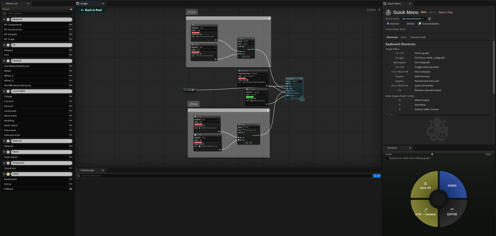
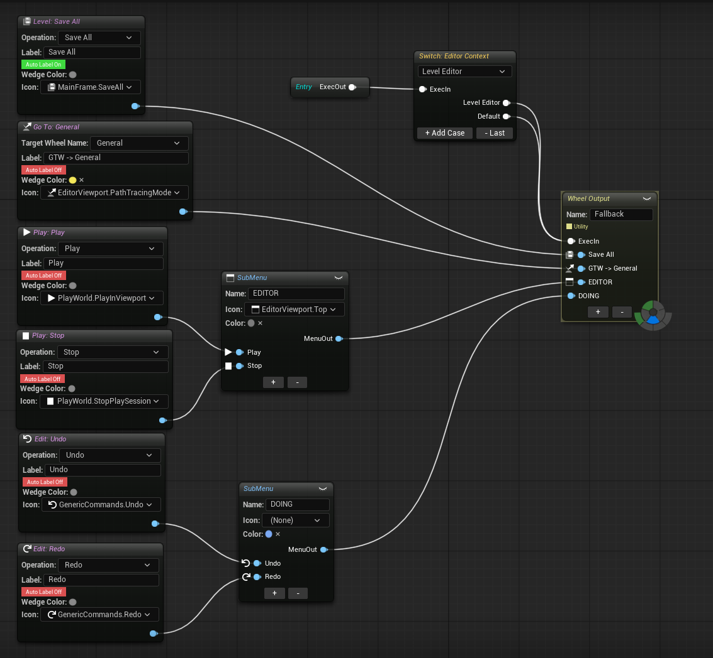
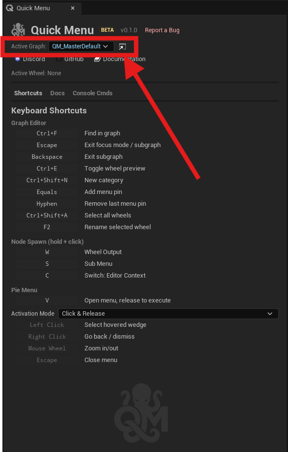
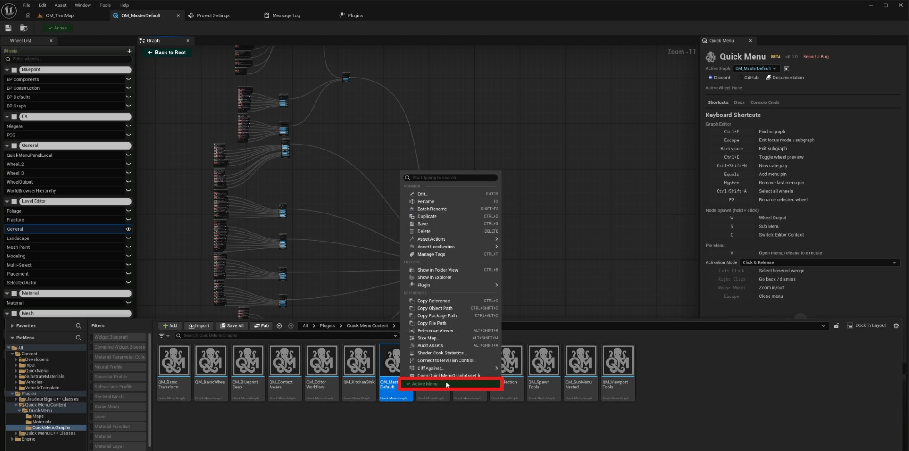

# Creating Your First Wheel

This guide walks you through creating a Quick Menu Graph and your first pie menu wheel in under 5 minutes.

## Step 1: Create a Graph Asset

1. In the **Content Browser**, click **Add** → **Quick Menu** → **Quick Menu Graph**
2. Name it (e.g., "MyMenuGraph")
3. Double-click to open it in the graph editor

<video autoplay="true" loop="true" muted="true" playsinline="true" width="100%">
<source src="/img/CreateQuickMenuGraph.mp4" type="video/mp4">
</video>

## Step 2: Understand the Layout

The graph editor has 4 panels:

- **Graph Canvas** (center) — where you place and connect nodes
- **Wheel List** (left) — lists all your wheels, organized by category
- **Preview** (right) — live pie menu preview of the selected wheel
- **Find Results** (bottom, Ctrl+F) — search across all nodes

## Step 3: Add a WheelOutput

The **Root** node is already placed. Now add a wheel:

1. Right-click on the canvas → search "WheelOutput" → click to place it
2. Connect the Root's exec output (white pin) to the WheelOutput's exec input
3. Name your wheel in the Details panel (e.g., "Main Tools")

**Shortcut:** Hold **W** and click on the canvas to instantly spawn a WheelOutput.

<video autoplay="true" loop="true" muted="true" playsinline="true" width="100%">
<source src="/img/SmartAutoWiringWClick.mp4" type="video/mp4">
</video>

## Step 4: Add Actions

1. Right-click the canvas → browse **Actions** categories or search
2. Add a few action nodes (e.g., Transform Mode, Select Op, Spawn Shape)
3. Connect each action's menu output (blue pin) to a WheelOutput menu input pin

**Shortcut:** Select your action nodes, then hold **W** and click — a WheelOutput spawns and auto-wires all selected actions.

## Step 5: Set as Active Graph

There are 3 ways to set a Quick Menu Graph as the active graph:

### From the Graph Editor

When a graph is open, click the **Active** badge in the top-left corner of the Graph tab. The green checkmark confirms the graph is currently active.

### From the Quick Menu Panel

Open the **Quick Menu** panel (click the octopus icon in the toolbar). Use the **Active Graph** dropdown at the top to select which graph to use.

### From the Content Browser

Right-click on any **Quick Menu Graph** asset in the Content Browser and select **Active Menu** to set it as the active graph.

## Step 6: Try It

Press **V** anywhere in the editor. Your pie menu appears with your actions.

<!-- Screenshot: pie menu open with the 4 actions -->

## Next Steps

- [Learn the graph system concepts](../concepts/graph-system.md)
- [Add context-aware switching](../concepts/context-detection.md)
- [Browse all action types](../nodes/actions-spawn.md)
- [Customize wedge appearance](../customization/wedge-appearance.md)
